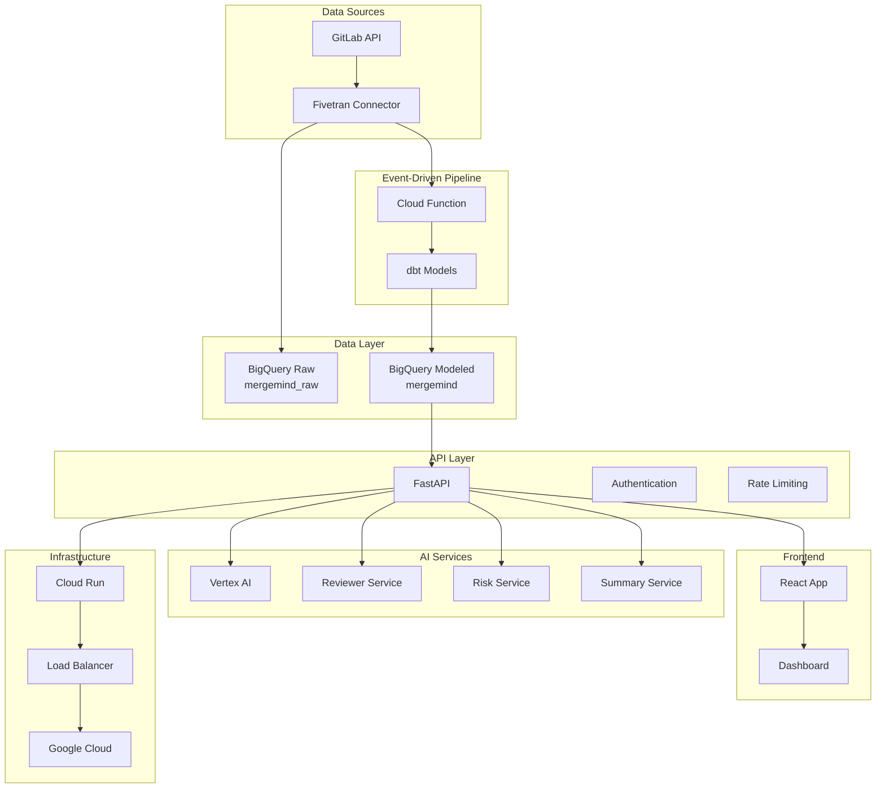

# MergeMind: An AI-Powered Software Development Intelligence Platform

MergeMind is an advanced analytics and insights platform for GitLab. It leverages a custom Fivetran connector, Google BigQuery, and Google Vertex AI to provide engineering teams with powerful tools to enhance productivity, reduce risk, and streamline the code review process.

## Fivetran Challenge Submission

This project is a submission for the **Fivetran Challenge**. It demonstrates a complete, end-to-end solution that meets and exceeds the challenge requirements:

1.  **Custom Fivetran Connector:** We built a sophisticated, production-ready Fivetran connector for the GitLab API.
2.  **Google Cloud Integration:** The connector loads data into **Google BigQuery**, which is then used to power our AI application.
3.  **Industry-Focused AI Application:** We developed an AI-powered intelligence engine using **Google Vertex AI** to solve common problems in the software development lifecycle (SDLC), providing augmented analytics for engineering teams.
4.  **Modern AI & Data Relevance:** The solution showcases the use of LLMs for multi-step reasoning, automated summarization, and proactive risk and security analysis.

---

## 🚀 Key Features

### 1. Custom Fivetran Connector for GitLab

A robust, production-grade Fivetran connector that extracts critical SDLC data from the GitLab API.

-   **Incremental Syncs:** Efficiently syncs merge requests using `updated_after` timestamps to minimize data transfer and API load.
-   **Dynamic Project Discovery:** Automatically discovers and syncs GitLab projects based on configurable naming patterns, making the connector highly scalable and low-maintenance.
-   **Performance Optimized:** Utilizes batching techniques (e.g., for fetching users) to avoid the N+1 problem and improve sync performance.
-   **Automated dbt Integration:** Triggers a dbt run upon successful data synchronization, enabling a fully automated, end-to-end data pipeline from extraction to transformation.

### 2. AI-Powered Intelligence Engine

At the core of MergeMind is a sophisticated AI engine built on Google Vertex AI that provides deep insights into every merge request.

-   **AI Reviewer Suggester:** A smart recommendation system that suggests the best possible reviewers for a merge request.
    -   **Multi-Step AI Reasoning:** Uses a chain of LLM prompts to first analyze the required expertise, then analyze reviewer workload, and finally synthesize the results into a ranked list of suggestions.
    -   **Holistic Analysis:** Considers not just technical expertise but also reviewer workload, availability, and fairness to provide practical and balanced recommendations.

-   **AI Risk Assessor:** A comprehensive risk analysis tool that provides both a quantitative score and qualitative feedback on every code change.
    -   **Multi-Vector Analysis:** Decomposes "risk" into three key areas—**Code Patterns**, **Security**, and **Complexity**—and uses a dedicated LLM prompt to analyze each one.
    -   **Proactive Security Scanning:** The security analysis prompt specifically instructs the LLM to look for common vulnerabilities like SQL Injection, XSS, and sensitive data exposure, acting as an automated security audit.
    -   **Tunable Weighted Scoring:** Combines the scores from the three vectors into a single, weighted risk score, allowing the model to be tuned to organizational priorities.

-   **AI Diff Summarizer:** Automatically generates clear, concise summaries of merge requests.
    -   **Intelligent Caching:** Features a smart caching mechanism that uses the commit SHA as part of the cache key, ensuring summaries are only regenerated when the code actually changes, saving time and cost.

### 3. Modern, Scalable Architecture

-   **Data Pipeline:** Fivetran -> Google BigQuery -> dbt
-   **Backend:** FastAPI (Python)
-   **AI Services:** Google Vertex AI
-   **Frontend:** React
-   **Infrastructure:** Deployed on Google Cloud Run, managed with Terraform.

## 📋 Table of Contents

- [Quick Start](#quick-start)
- [Architecture](#architecture)
- [Installation](#installation)
- [Configuration](#configuration)
- [API Documentation](#api-documentation)
- [Deployment](#deployment)
- [Monitoring](#monitoring)
- [Security](#security)
- [Contributing](#contributing)
- [License](#license)

## 🏃‍♂️ Quick Start

### Prerequisites

- Python 3.11+
- Node.js 18+
- Google Cloud Platform account
- GitLab instance (self-hosted or GitLab.com)
- Fivetran account (for data ingestion)

### Local Development

1. **Clone the repository**
   ```bash
   git clone https://github.com/mergemind/mergemind.git
   cd mergemind
   ```

2. **Set up environment**
   ```bash
   # Copy environment template
   cp .env.example .env
   
   # Edit configuration
   nano .env
   ```

3. **Install dependencies**
   ```bash
   # Install API dependencies
   cd api/fastapi_app
   pip install -r requirements.txt
   
   # Install UI dependencies
   cd ../../ui/react_app
   npm install
   ```

4. **Start services**
   ```bash
   # Start API (terminal 1)
   cd api/fastapi_app
   uvicorn main:app --reload --port 8080
   
   # Start UI (terminal 2)
   cd ui/react_app
   npm run dev
   ```

5. **Access the application**
   - API: http://localhost:8080
   - UI: http://localhost:5173
   - API Docs: http://localhost:8080/docs

## 🏗️ Architecture



### Core Components

- **Data Ingestion**: Fivetran custom connector for GitLab data
- **Event-Driven Pipeline**: Cloud Function triggers dbt runs on new data
- **Data Warehouse**: BigQuery with raw (`mergemind_raw`) and modeled (`mergemind`) datasets
- **dbt Transformations**: Automated data modeling and transformations
- **AI Services**: Vertex AI for diff summarization and analysis
- **API Layer**: FastAPI with comprehensive endpoints
- **Frontend**: React dashboard for MR management

## 📦 Installation

### Docker Compose (Recommended)

```bash
# Clone repository
git clone https://github.com/mergemind/mergemind.git
cd mergemind

# Copy environment file
cp .env.example .env

# Edit configuration
nano .env

# Start services
docker-compose up -d

# Check status
docker-compose ps
```

### Manual Installation

#### 1. API Setup

```bash
cd api/fastapi_app

# Create virtual environment
python -m venv venv
source venv/bin/activate  # On Windows: venv\Scripts\activate

# Install dependencies
pip install -r requirements.txt

# Run tests
python run_tests.py

# Start development server
uvicorn main:app --reload --port 8080
```

#### 2. UI Setup

```bash
cd ui/react_app

# Install dependencies
npm install

# Start development server
npm run dev

# Build for production
npm run build
```

#### 3. Data Pipeline Setup

```bash
cd warehouse/bigquery/dbt

# Install dbt
pip install dbt-bigquery

# Install dbt packages
dbt deps

# Run models
dbt run

# Run tests
dbt test
```

## 🔄 Event-Driven Data Pipeline

The MergeMind platform features a fully automated event-driven data pipeline that processes GitLab data in real-time:

### Pipeline Flow

1. **GitLab Events** → New merge requests, updates, or changes
2. **Fivetran Sync** → Custom connector syncs data to BigQuery
3. **Cloud Function Trigger** → Fivetran calls Cloud Function on sync completion
4. **dbt Transformations** → Automated data modeling and transformations
5. **BigQuery Updates** → Transformed data available for API consumption

### Key Components

#### Fivetran Connector
- **Location**: `ingestion/fivetran_connector/`
- **Features**: Custom GitLab API connector with dbt trigger integration
- **Configuration**: Environment variables for GitLab and Cloud Function URLs
- **Sync Frequency**: Configurable (default: 1 hour)

#### Cloud Function (dbt Trigger)
- **Location**: `infra/gcp/terraform/cloud_function/`
- **Purpose**: Triggers dbt runs when new data arrives
- **Runtime**: Python 3.11 with dbt-core and dbt-bigquery
- **Timeout**: 5 minutes (configurable)
- **Authentication**: Bearer token for security

#### dbt Models
- **Location**: `warehouse/bigquery/dbt/models/`
- **Transformations**: Raw data → Clean, modeled datasets
- **Output**: `mergemind` dataset with business-ready views

### Deployment

```bash
# Deploy infrastructure
cd infra/gcp/terraform
terraform init
terraform plan
terraform apply

# Deploy Fivetran connector
cd ingestion/fivetran_connector
# Configure fivetran_config.json with your settings
# Deploy to Fivetran platform

# Test the pipeline
# Create a merge request in GitLab
# Monitor Fivetran sync logs
# Verify dbt transformations in BigQuery
```

### Monitoring

- **Fivetran Logs**: Monitor sync status and dbt trigger calls
- **Cloud Function Logs**: Check dbt execution and errors
- **BigQuery**: Verify data transformations and model updates
- **API Endpoints**: Test data availability and freshness

## ⚙️ Configuration

### Environment Variables

```bash
# GCP Configuration
GCP_PROJECT_ID=your-project-id
BQ_DATASET_RAW=mergemind_raw
BQ_DATASET_MODELED=mergemind
VERTEX_LOCATION=us-central1

# GitLab Configuration
GITLAB_BASE_URL=https://your-gitlab.com
GITLAB_TOKEN=glpat-your-token

# Event-Driven Pipeline Configuration
DBT_TRIGGER_URL=https://dbt-trigger-function-xxx-uc.a.run.app
DBT_TRIGGER_AUTH_TOKEN=your-secure-token-here

# API Configuration
API_BASE_URL=https://api.mergemind.com
LOG_LEVEL=INFO
ENVIRONMENT=production

# Security
SECRET_KEY=your-secret-key
ALLOWED_HOSTS=api.mergemind.com,mergemind.com
```

### BigQuery Setup

```sql
-- Create datasets
CREATE SCHEMA `mergemind_raw`;
CREATE SCHEMA `mergemind`;

-- Create tables with schemas
CREATE TABLE `mergemind_raw.merge_requests` (
  mr_id INT64,
  project_id INT64,
  title STRING,
  description STRING,
  author_id INT64,
  state STRING,
  created_at TIMESTAMP,
  updated_at TIMESTAMP,
  additions INT64,
  deletions INT64,
  web_url STRING
);

CREATE TABLE `mergemind_raw.mr_notes` (
  id INT64,
  mr_id INT64,
  author_id INT64,
  note_type STRING,
  body STRING,
  created_at TIMESTAMP
);

CREATE TABLE `mergemind_raw.users` (
  user_id INT64,
  username STRING,
  name STRING,
  email STRING,
  state STRING,
  created_at TIMESTAMP
);

CREATE TABLE `mergemind_raw.projects` (
  project_id INT64,
  name STRING,
  description STRING,
  visibility STRING,
  created_at TIMESTAMP
);

CREATE TABLE `mergemind_raw.pipelines` (
  pipeline_id INT64,
  project_id INT64,
  status STRING,
  ref STRING,
  created_at TIMESTAMP,
  updated_at TIMESTAMP
);
```

### dbt Models

```bash
cd warehouse/bigquery/dbt

# Install packages
dbt deps

# Run models
dbt run

# Test models
dbt test

# Generate documentation
dbt docs generate
dbt docs serve
```

## 📚 API Documentation

### Base URL
- **Development**: `http://localhost:8080/api/v1`
- **Production**: `https://api.mergemind.com/api/v1`

### Authentication
Currently no authentication required for MVP. Future versions will support API keys and OAuth.

### Endpoints

#### Health Check
- `GET /healthz` - Basic health check
- `GET /ready` - Readiness check with dependency validation
- `GET /health/detailed` - Comprehensive health check with metrics

#### Merge Requests
- `GET /mrs` - List merge requests with risk analysis
- `GET /blockers/top` - Get top blocking merge requests

#### Individual MR
- `GET /mr/{id}/context` - Get comprehensive MR context
- `POST /mr/{id}/summary` - Generate AI summary
- `GET /mr/{id}/reviewers` - Get suggested reviewers
- `GET /mr/{id}/risk` - Get risk analysis
- `GET /mr/{id}/stats` - Get MR statistics

#### Metrics
- `GET /metrics` - Get application metrics
- `GET /metrics/slo` - Get SLO status and violations
- `POST /metrics/reset` - Reset metrics (admin only)

### Example Usage

```bash
# List open merge requests
curl "https://api.mergemind.com/api/v1/mrs?state=open&limit=20"

# Get MR context
curl "https://api.mergemind.com/api/v1/mr/123/context"

# Generate AI summary
curl -X POST "https://api.mergemind.com/api/v1/mr/123/summary"

# Get reviewer suggestions
curl "https://api.mergemind.com/api/v1/mr/123/reviewers"

# Get risk analysis
curl "https://api.mergemind.com/api/v1/mr/123/risk"
```

For complete API documentation, see [API Reference](docs/API_REFERENCE.md).

## 🚀 Deployment

### Google Cloud Run (Recommended)

```bash
# Build and push Docker images
docker build -t gcr.io/your-project/mergemind-api:latest api/fastapi_app/
docker push gcr.io/your-project/mergemind-api:latest

docker build -t gcr.io/your-project/mergemind-ui:latest ui/react_app/
docker push gcr.io/your-project/mergemind-ui:latest

# Deploy to Cloud Run
gcloud run deploy mergemind-api \
  --image gcr.io/your-project/mergemind-api:latest \
  --platform managed \
  --region us-central1 \
  --allow-unauthenticated \
  --port 8080 \
  --memory 2Gi \
  --cpu 2 \
  --max-instances 10

gcloud run deploy mergemind-ui \
  --image gcr.io/your-project/mergemind-ui:latest \
  --platform managed \
  --region us-central1 \
  --allow-unauthenticated \
  --port 3000 \
  --memory 512Mi \
  --cpu 1 \
  --max-instances 5
```

### Kubernetes

```bash
# Create cluster
gcloud container clusters create mergemind-cluster \
  --zone us-central1-a \
  --num-nodes 3 \
  --machine-type e2-standard-4

# Deploy with Helm
helm install mergemind ./helm/mergemind \
  --set gcp.projectId=your-project-id \
  --set gitlab.baseUrl=https://your-gitlab.com
```

For detailed deployment instructions, see [Deployment Guide](docs/DEPLOYMENT.md).

## 📊 Monitoring

### Health Checks

```bash
# Basic health check
curl "https://api.mergemind.com/api/v1/healthz"

# Detailed health check
curl "https://api.mergemind.com/api/v1/health/detailed"

# SLO status
curl "https://api.mergemind.com/api/v1/metrics/slo"
```

### Metrics

The application exposes Prometheus-compatible metrics:

- Request count and duration
- Error rates and types
- Business metrics (MR analysis, AI summaries)
- External service health

### Alerting

Configure alerts for:
- High error rates (>1%)
- High latency (P95 > 2s)
- Service downtime
- BigQuery quota exceeded
- AI service failures

For comprehensive monitoring setup, see [Monitoring Guide](docs/MONITORING.md).

## 🔒 Security

### Security Features

- Input validation and sanitization
- Rate limiting and DDoS protection
- HTTPS enforcement
- Security headers
- Data encryption at rest and in transit
- Access logging and audit trails

### Compliance

- GDPR compliance for data protection
- SOC 2 Type II compliance
- Security incident response plan
- Regular security audits

For detailed security information, see [Security Guide](docs/SECURITY.md).

## 🧪 Testing

### Run Tests

```bash
# API tests
cd api/fastapi_app
python run_tests.py

# Run specific test types
python run_tests.py --type unit
python run_tests.py --type integration

# Run with coverage
python run_tests.py --coverage

# UI tests
cd ui/react_app
npm test
npm run test:coverage
```

### Test Coverage

- **Unit Tests**: Service layer components
- **Integration Tests**: End-to-end workflows
- **API Tests**: Endpoint functionality
- **Performance Tests**: Load and stress testing

## 🤝 Contributing

We welcome contributions! Please see our [Contributing Guide](CONTRIBUTING.md) for details.

### Development Setup

1. Fork the repository
2. Create a feature branch
3. Make your changes
4. Add tests
5. Submit a pull request

### Code Style

- Python: Black, isort, flake8
- JavaScript: Prettier, ESLint
- TypeScript: Strict mode enabled

## 📄 License

This project is licensed under the MIT License - see the [LICENSE](LICENSE) file for details.

## 🆘 Support

- **Documentation**: [docs/](docs/)
- **Issues**: [GitHub Issues](https://github.com/mergemind/mergemind/issues)
- **Discussions**: [GitHub Discussions](https://github.com/mergemind/mergemind/discussions)
- **Email**: support@mergemind.com

## 🗺️ Roadmap

### v1.1.0 (Q2 2024)
- Authentication and authorization
- Webhook notifications
- Bulk operations
- Advanced filtering and search

### v1.2.0 (Q3 2024)
- Real-time updates
- Advanced analytics
- Custom risk rules
- Team collaboration features

### v2.0.0 (Q4 2024)
- Multi-repository support
- Advanced AI models
- Enterprise features
- Self-hosted deployment

## 🙏 Acknowledgments

- [FastAPI](https://fastapi.tiangolo.com/) for the API framework
- [React](https://reactjs.org/) for the frontend framework
- [BigQuery](https://cloud.google.com/bigquery) for data warehousing
- [Vertex AI](https://cloud.google.com/vertex-ai) for AI services
- [Fivetran](https://fivetran.com/) for data ingestion

---

**MergeMind** - Making merge request analysis intelligent and efficient. 🚀