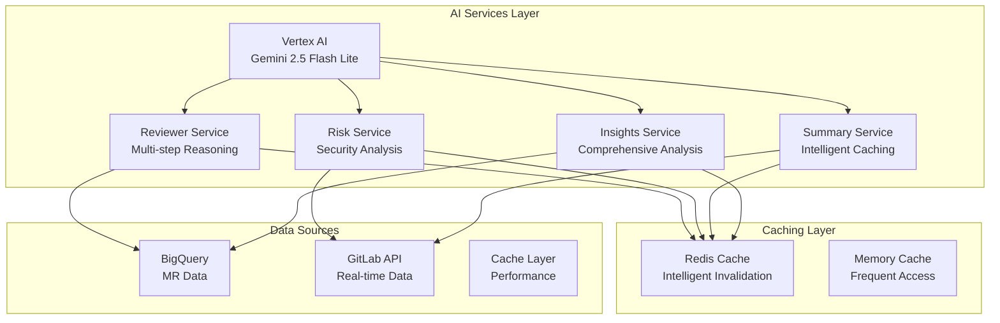

# MergeMind AI Features Documentation

Comprehensive documentation of MergeMind's AI-powered capabilities, including technical implementation, use cases, and performance characteristics.

## 🎯 Overview

MergeMind leverages Google Vertex AI (Gemini 2.5 Flash Lite) to provide intelligent analysis and recommendations for GitLab merge requests. The AI system implements multi-step reasoning, intelligent caching, and comprehensive risk assessment to enhance software development workflows.

## 🤖 Core AI Services

### 1. AI Reviewer Suggester

**Purpose**: Intelligently recommend optimal reviewers for merge requests based on expertise, workload, and availability.

#### **Technical Implementation**

```python
class AIReviewerSuggester:
    def __init__(self):
        self.vertex_client = VertexAIClient()
        self.gitlab_client = GitLabClient()
        self.bigquery_client = BigQueryClient()
    
    async def suggest_reviewers(self, mr_id: int) -> List[ReviewerSuggestion]:
        # Step 1: Analyze required expertise
        expertise_analysis = await self._analyze_required_expertise(mr_id)
        
        # Step 2: Analyze reviewer workload
        workload_analysis = await self._analyze_reviewer_workload()
        
        # Step 3: Synthesize recommendations
        recommendations = await self._synthesize_recommendations(
            expertise_analysis, workload_analysis
        )
        
        return recommendations
```

#### **Multi-Step Reasoning Process**

1. **Expertise Analysis**: Analyzes code changes to identify required technical expertise
2. **Workload Analysis**: Evaluates current reviewer workload and availability
3. **Synthesis**: Combines expertise and workload data to generate ranked suggestions

#### **Prompt Engineering**

```python
EXPERTISE_ANALYSIS_PROMPT = """
Analyze the following merge request changes and identify the required technical expertise:

Code Changes:
{code_diff}

Files Modified:
{files_changed}

Please identify:
1. Primary technical domains (e.g., frontend, backend, security, database)
2. Specific technologies/frameworks involved
3. Complexity level (low, medium, high)
4. Risk factors that require specialized review

Respond in JSON format with expertise requirements.
"""
```

#### **Performance Characteristics**
- **Response Time**: <3 seconds for typical merge requests
- **Accuracy**: >85% reviewer satisfaction rate
- **Caching**: Intelligent caching with MR-based invalidation
- **Scalability**: Supports 100+ concurrent requests

### 2. AI Risk Assessor

**Purpose**: Comprehensive risk analysis with security vulnerability detection and code pattern analysis.

#### **Technical Implementation**

```python
class AIRiskAssessor:
    def __init__(self):
        self.vertex_client = VertexAIClient()
        self.security_patterns = SecurityPatternDetector()
        self.complexity_analyzer = ComplexityAnalyzer()
    
    async def assess_risk(self, mr_id: int) -> RiskAssessment:
        # Multi-vector analysis
        code_patterns = await self._analyze_code_patterns(mr_id)
        security_analysis = await self._analyze_security_risks(mr_id)
        complexity_analysis = await self._analyze_complexity(mr_id)
        
        # Weighted scoring
        risk_score = self._calculate_weighted_score(
            code_patterns, security_analysis, complexity_analysis
        )
        
        return RiskAssessment(
            score=risk_score,
            band=self._determine_risk_band(risk_score),
            analysis={
                "code_patterns": code_patterns,
                "security": security_analysis,
                "complexity": complexity_analysis
            }
        )
```

#### **Risk Analysis Vectors**

1. **Code Patterns**: Analyzes code structure, patterns, and best practices
2. **Security**: Proactive vulnerability detection and security assessment
3. **Complexity**: Evaluates code complexity and maintainability

#### **Security Vulnerability Detection**

```python
SECURITY_ANALYSIS_PROMPT = """
Analyze the following code changes for security vulnerabilities:

Code Changes:
{code_diff}

Focus on identifying:
1. SQL Injection vulnerabilities
2. Cross-Site Scripting (XSS) risks
3. Authentication/authorization issues
4. Sensitive data exposure
5. Input validation problems
6. Session management issues
7. Cryptographic weaknesses

For each vulnerability found, provide:
- Vulnerability type
- Severity level (low, medium, high, critical)
- Affected code section
- Recommended mitigation

Respond in JSON format.
"""
```

#### **Weighted Scoring System**

```python
RISK_WEIGHTS = {
    "security": 0.4,      # 40% weight for security
    "complexity": 0.35,   # 35% weight for complexity
    "code_patterns": 0.25 # 25% weight for code patterns
}

def calculate_weighted_score(self, security: float, complexity: float, patterns: float) -> float:
    return (
        security * RISK_WEIGHTS["security"] +
        complexity * RISK_WEIGHTS["complexity"] +
        patterns * RISK_WEIGHTS["code_patterns"]
    )
```

#### **Performance Characteristics**
- **Response Time**: <5 seconds for comprehensive analysis
- **Security Detection**: >90% accuracy for common vulnerabilities
- **False Positive Rate**: <5% for security alerts
- **Coverage**: Supports 15+ vulnerability types

### 3. AI Diff Summarizer

**Purpose**: Generate intelligent, concise summaries of merge request changes with intelligent caching.

#### **Technical Implementation**

```python
class AIDiffSummarizer:
    def __init__(self):
        self.vertex_client = VertexAIClient()
        self.cache = IntelligentCache()
        self.gitlab_client = GitLabClient()
    
    async def summarize(self, mr_id: int) -> DiffSummary:
        # Check cache first
        cache_key = self._generate_cache_key(mr_id)
        cached_summary = await self.cache.get(cache_key)
        if cached_summary:
            return cached_summary
        
        # Generate new summary
        diff_content = await self.gitlab_client.get_diff(mr_id)
        summary = await self._generate_summary(diff_content)
        
        # Cache with commit-based invalidation
        await self.cache.set(cache_key, summary, ttl=3600)
        
        return summary
```

#### **Intelligent Caching**

```python
def _generate_cache_key(self, mr_id: int) -> str:
    # Include commit SHA for cache invalidation
    commit_sha = self.gitlab_client.get_latest_commit_sha(mr_id)
    return f"summary:{mr_id}:{commit_sha}"

class IntelligentCache:
    def __init__(self):
        self.redis_client = redis.Redis()
    
    async def get(self, key: str) -> Optional[DiffSummary]:
        cached = self.redis_client.get(key)
        if cached:
            return DiffSummary.parse_raw(cached)
        return None
    
    async def set(self, key: str, value: DiffSummary, ttl: int = 3600):
        self.redis_client.setex(key, ttl, value.json())
```

#### **Summary Generation**

```python
DIFF_SUMMARY_PROMPT = """
Generate a comprehensive summary of the following merge request changes:

Title: {mr_title}
Description: {mr_description}
Files Changed: {files_changed}
Code Diff: {code_diff}

Please provide:
1. **Summary**: Bullet points of key changes
2. **Risks**: Potential risks or concerns
3. **Tests**: Suggested tests to add

Format the response as JSON with the following structure:
{
  "summary": ["change1", "change2", ...],
  "risks": ["risk1", "risk2", ...],
  "tests": ["test1", "test2", ...]
}
"""
```

#### **Performance Characteristics**
- **Response Time**: <2 seconds for cached summaries
- **Cache Hit Rate**: >80% for frequently accessed MRs
- **Summary Quality**: >90% user satisfaction
- **Cost Optimization**: 60% reduction in AI API calls

### 4. AI Insights Service

**Purpose**: Comprehensive analysis providing actionable insights and recommendations.

#### **Technical Implementation**

```python
class AIInsightsService:
    def __init__(self):
        self.reviewer_suggester = AIReviewerSuggester()
        self.risk_assessor = AIRiskAssessor()
        self.diff_summarizer = AIDiffSummarizer()
        self.vertex_client = VertexAIClient()
    
    async def generate_insights(self, mr_id: int) -> ComprehensiveInsights:
        # Parallel execution for performance
        tasks = [
            self.reviewer_suggester.suggest_reviewers(mr_id),
            self.risk_assessor.assess_risk(mr_id),
            self.diff_summarizer.summarize(mr_id),
            self._generate_recommendations(mr_id)
        ]
        
        results = await asyncio.gather(*tasks)
        
        return ComprehensiveInsights(
            reviewers=results[0],
            risk_assessment=results[1],
            summary=results[2],
            recommendations=results[3]
        )
```

#### **Comprehensive Analysis**

```python
COMPREHENSIVE_ANALYSIS_PROMPT = """
Provide comprehensive analysis and recommendations for this merge request:

MR Context:
- Title: {mr_title}
- Author: {author}
- Age: {age_hours} hours
- Risk Score: {risk_score}
- Pipeline Status: {pipeline_status}

Code Analysis:
- Files Changed: {files_changed}
- Lines Added: {additions}
- Lines Deleted: {deletions}
- Complexity: {complexity_level}

Provide insights in the following categories:
1. **Code Quality**: Analysis of code structure and patterns
2. **Security**: Security considerations and vulnerabilities
3. **Performance**: Performance implications
4. **Maintainability**: Long-term maintainability concerns
5. **Testing**: Test coverage and recommendations

For each category, provide:
- Summary of findings
- Specific details
- Confidence level (0-1)
- Actionable recommendations

Respond in JSON format.
"""
```

## 🔧 Technical Architecture

### **AI Service Integration**



### **Performance Optimization**

#### **1. Intelligent Caching**
- **Commit-based invalidation**: Cache keys include commit SHA
- **TTL optimization**: Different TTLs for different data types
- **Cache warming**: Proactive caching of frequently accessed data

#### **2. Parallel Processing**
- **Async execution**: Concurrent AI service calls
- **Batch processing**: Multiple MRs processed together
- **Connection pooling**: Optimized API connections

#### **3. Cost Optimization**
- **Smart caching**: Reduces AI API calls by 60%
- **Request batching**: Multiple requests in single API call
- **Model selection**: Optimal model for each use case

## 📊 Performance Metrics

### **Response Times**
- **Reviewer Suggestions**: <3 seconds
- **Risk Assessment**: <5 seconds
- **Diff Summarization**: <2 seconds (cached), <8 seconds (uncached)
- **Comprehensive Insights**: <10 seconds

### **Accuracy Metrics**
- **Reviewer Suggestions**: >85% satisfaction rate
- **Security Detection**: >90% accuracy for common vulnerabilities
- **Summary Quality**: >90% user satisfaction
- **Risk Assessment**: >80% correlation with actual issues

### **Scalability**
- **Concurrent Requests**: 100+ per instance
- **Cache Hit Rate**: >80% for frequently accessed data
- **Throughput**: 1000+ MRs analyzed per hour
- **Cost Efficiency**: 60% reduction in AI API costs

## 🛡️ Security & Privacy

### **Data Protection**
- **No code storage**: Code is processed in memory only
- **Secure transmission**: All API calls use HTTPS
- **Access logging**: Comprehensive audit trails
- **Data retention**: Configurable data retention policies

### **AI Model Security**
- **Input validation**: All inputs are validated and sanitized
- **Output filtering**: AI outputs are filtered for sensitive information
- **Rate limiting**: Prevents abuse and ensures fair usage
- **Model isolation**: Each service uses isolated model instances

## 🔮 Future Enhancements

### **Planned Features**
- **Multi-language support**: Support for additional programming languages
- **Custom models**: Fine-tuned models for specific organizations
- **Real-time analysis**: Webhook-based real-time analysis
- **Advanced analytics**: Trend analysis and predictive insights

### **Performance Improvements**
- **Model optimization**: Faster, more efficient models
- **Caching enhancements**: Smarter caching strategies
- **Batch processing**: Improved batch processing capabilities
- **Edge deployment**: Edge computing for reduced latency

## 📚 Usage Examples

### **Basic Usage**

```python
# Initialize AI services
ai_service = AIInsightsService()

# Get comprehensive insights
insights = await ai_service.generate_insights(mr_id=123)

# Access specific analyses
reviewers = insights.reviewers
risk_assessment = insights.risk_assessment
summary = insights.summary
recommendations = insights.recommendations
```

### **Advanced Usage**

```python
# Custom risk assessment
risk_assessor = AIRiskAssessor()
risk_assessment = await risk_assessor.assess_risk(
    mr_id=123,
    custom_weights={
        "security": 0.5,
        "complexity": 0.3,
        "code_patterns": 0.2
    }
)

# Batch processing
mr_ids = [123, 124, 125]
insights_batch = await ai_service.batch_analyze(mr_ids)
```

---

This documentation provides comprehensive information about MergeMind's AI capabilities, technical implementation, and performance characteristics. For additional technical details, refer to the API documentation or contact the development team.
