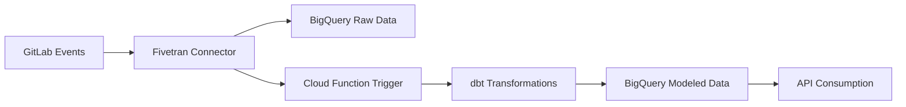

# Event-Driven Data Pipeline Documentation

## Overview

The MergeMind platform implements a fully automated event-driven data pipeline that processes GitLab data in real-time, eliminating the need for scheduled batch processing. This document provides comprehensive information about the pipeline architecture, components, and operations.

## Architecture



## Components

### 1. Fivetran Connector

**Location**: `ingestion/fivetran_connector/`

**Purpose**: Custom GitLab API connector that syncs data and triggers dbt runs

**Key Features**:
- Incremental data sync from GitLab API
- Automatic dbt trigger on sync completion
- Configurable sync intervals
- Environment variable support for secure configuration

**Configuration**:
```json
{
  "gitlab_token": "glpat-your-token",
  "gitlab_base_url": "https://your-gitlab.com",
  "dbt_trigger_url": "https://dbt-trigger-function-xxx-uc.a.run.app",
  "dbt_trigger_auth_token": "your-secure-token",
  "sync_interval_hours": "1"
}
```

### 2. Cloud Function (dbt Trigger)

**Location**: `infra/gcp/terraform/cloud_function/`

**Purpose**: HTTP-triggered function that runs dbt transformations

**Key Features**:
- Python 3.11 runtime with dbt-core and dbt-bigquery
- 5-minute timeout for dbt execution
- Bearer token authentication
- Automatic dbt dependency installation
- Comprehensive error handling and logging

**Environment Variables**:
```bash
PROJECT_ID=your-project-id
BQ_DATASET_RAW=mergemind_raw
BQ_DATASET_MODELED=mergemind
AUTH_TOKEN=your-secure-token
```

### 3. dbt Models

**Location**: `warehouse/bigquery/dbt/models/`

**Purpose**: Transform raw GitLab data into business-ready datasets

**Key Features**:
- Automated data modeling and transformations
- Incremental model updates
- Data quality tests
- Documentation and lineage tracking

## Data Flow

### 1. GitLab Event
- New merge request created
- Merge request updated
- User activity changes

### 2. Fivetran Sync
- Connector polls GitLab API
- Fetches incremental changes
- Syncs data to BigQuery `mergemind_raw` dataset

### 3. Cloud Function Trigger
- Fivetran calls Cloud Function on sync completion
- Function validates authentication token
- Triggers dbt run with sync metadata

### 4. dbt Transformations
- Downloads dbt project from repository
- Installs dependencies (if needed)
- Runs dbt models and tests
- Updates BigQuery `mergemind` dataset

### 5. API Consumption
- Transformed data available for API endpoints
- Real-time insights and analytics
- Dashboard updates

## Deployment

### Prerequisites
- Google Cloud Platform account
- Fivetran account
- GitLab instance access
- Terraform installed

### Step 1: Deploy Infrastructure
```bash
cd infra/gcp/terraform
terraform init
terraform plan
terraform apply
```

### Step 2: Configure Fivetran Connector
```bash
cd ingestion/fivetran_connector
# Update fivetran_config.json with your settings
# Deploy to Fivetran platform
```

### Step 3: Test Pipeline
```bash
# Create a merge request in GitLab
# Monitor Fivetran sync logs
# Verify dbt transformations in BigQuery
```

## Monitoring

### Fivetran Logs
Monitor sync status and dbt trigger calls:
```
INFO:connector:Successfully triggered dbt run
INFO:connector:dbt trigger response: {"status": "success"}
```

### Cloud Function Logs
Check dbt execution and errors:
```bash
gcloud functions logs read dbt-trigger-function --region=us-central1 --limit=10
```

### BigQuery Monitoring
Verify data transformations:
```sql
-- Check raw data
SELECT COUNT(*) FROM `project.mergemind_raw.merge_requests`;

-- Check transformed data
SELECT COUNT(*) FROM `project.mergemind.dim_merge_requests`;
```

## Troubleshooting

### Common Issues

#### 1. Cloud Function Timeout
**Symptoms**: `Read timed out. (read timeout=60)`
**Solution**: Increase timeout in connector configuration

#### 2. dbt Dependencies Missing
**Symptoms**: `No such file or directory: 'dbt'`
**Solution**: Ensure dbt-core and dbt-bigquery are in requirements.txt

#### 3. Authentication Failures
**Symptoms**: `Unauthorized access attempt`
**Solution**: Verify AUTH_TOKEN matches between connector and Cloud Function

#### 4. Environment Variable Issues
**Symptoms**: `${GITLAB_BASE_URL}` not resolved
**Solution**: Use direct configuration values instead of environment variables

### Debug Commands

```bash
# Test Cloud Function directly
curl -X POST "https://dbt-trigger-function-xxx-uc.a.run.app" \
  -H "Authorization: Bearer your-token" \
  -H "Content-Type: application/json" \
  -d '{"source": "test", "action": "run_dbt"}'

# Check BigQuery data
bq query --use_legacy_sql=false "
SELECT COUNT(*) as total_mrs 
FROM \`project.mergemind_raw.merge_requests\`
"

# Monitor Fivetran connector
# Check connector logs in Fivetran dashboard
```

## Performance Optimization

### Sync Frequency
- Default: 1 hour
- Recommended: 30 minutes for high-activity repositories
- Minimum: 15 minutes (Fivetran limits)

### dbt Execution Time
- First run: ~2-3 minutes (dependency installation)
- Subsequent runs: ~30-60 seconds
- Timeout: 5 minutes (configurable)

### BigQuery Costs
- Raw data storage: ~$0.02 per GB per month
- Query processing: ~$5 per TB processed
- dbt runs: Minimal cost (small datasets)

## Security

### Authentication
- Bearer token authentication for Cloud Function
- GitLab API token for data access
- Service account for BigQuery operations

### Data Protection
- Environment variables for sensitive configuration
- .gitignore for configuration files
- Secure token generation and rotation

### Network Security
- HTTPS for all communications
- VPC network isolation (optional)
- IAM roles and permissions

## Future Enhancements

### Planned Features
- Real-time streaming with Pub/Sub
- Advanced error handling and retry logic
- Data quality monitoring and alerts
- Multi-region deployment support

### Scalability Improvements
- Parallel dbt model execution
- Incremental model optimization
- Caching for frequently accessed data
- Auto-scaling Cloud Function instances

## Support

For issues and questions:
1. Check troubleshooting section
2. Review logs and error messages
3. Verify configuration settings
4. Contact development team

## Changelog

### v1.0.0 (Current)
- Initial event-driven pipeline implementation
- Fivetran connector with dbt trigger
- Cloud Function for dbt execution
- Basic monitoring and logging

### Planned v1.1.0
- Enhanced error handling
- Performance optimizations
- Additional monitoring metrics
- Documentation improvements
