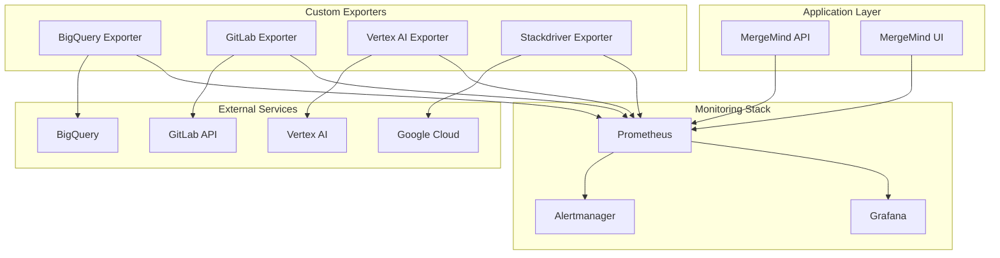

# MergeMind Monitoring Stack

Comprehensive monitoring and alerting infrastructure for the MergeMind system using Prometheus, Grafana, and custom exporters.

## 🏗️ Architecture



## 📦 Components

### Core Monitoring
- **Prometheus**: Metrics collection and storage
- **Grafana**: Visualization and dashboards
- **Alertmanager**: Alert routing and notifications

### Custom Exporters
- **BigQuery Exporter**: BigQuery usage and performance metrics
- **GitLab Exporter**: GitLab API health and usage metrics
- **Vertex AI Exporter**: AI service health and performance metrics
- **Stackdriver Exporter**: Google Cloud metrics

### System Monitoring
- **Node Exporter**: System-level metrics
- **cAdvisor**: Container metrics

## 🚀 Quick Start

### Prerequisites
- Docker and Docker Compose
- Google Cloud service account key
- GitLab API token
- Required environment variables

### Setup
```bash
# Clone repository
git clone https://github.com/mergemind/mergemind.git
cd mergemind/monitoring

# Set environment variables
export GCP_PROJECT_ID="your-project-id"
export GITLAB_BASE_URL="https://your-gitlab.com"
export GITLAB_TOKEN="glpat-your-token"

# Run setup script
./setup.sh
```

### Manual Setup
```bash
# Create environment file
cp .env.example .env
# Edit .env with your configuration

# Start monitoring stack
docker-compose up -d

# Check status
docker-compose ps
```

## ⚙️ Configuration

### Environment Variables
```bash
# GCP Configuration
GCP_PROJECT_ID=your-project-id
BQ_DATASET_RAW=mergemind_raw
BQ_DATASET_MODELED=mergemind
VERTEX_LOCATION=us-central1

# GitLab Configuration
GITLAB_BASE_URL=https://your-gitlab.com
GITLAB_TOKEN=glpat-your-token

# Monitoring Configuration
PROMETHEUS_RETENTION=30d
GRAFANA_ADMIN_PASSWORD=admin
```

### Prometheus Configuration
- **Scrape Interval**: 15s
- **Evaluation Interval**: 15s
- **Retention**: 30 days
- **Targets**: All services and exporters

### Alert Rules
- **Critical**: Service down, high error rate, high latency
- **Warning**: High CPU/memory usage, rate limits
- **Business**: Low MR analysis rate, AI service failures
- **SLO**: SLO violations, error budget exhaustion

### Notification Channels
- **Email**: Admin and team notifications
- **Slack**: Critical and warning alerts
- **PagerDuty**: Critical alerts only

## 📊 Dashboards

### MergeMind Overview
- Request rate and error rate
- Response time percentiles
- MR analysis and AI summary generation
- System health status

### Infrastructure
- CPU and memory usage
- Disk space and network
- Container health and performance

### Business Metrics
- MR analysis trends
- AI service performance
- User activity and engagement

### SLO Monitoring
- Error budget tracking
- SLO violation alerts
- Performance trends

## 🔔 Alerting

### Alert Categories

#### Critical Alerts
- Service down (>1 minute)
- High error rate (>5%)
- High latency (P95 >5s)
- BigQuery quota exceeded
- SLO violations

#### Warning Alerts
- High CPU usage (>80%)
- High memory usage (>80%)
- Disk space low (<10%)
- GitLab rate limit low
- Low MR analysis rate

#### Business Alerts
- AI service failures
- Data pipeline delays
- Vertex AI quota exceeded
- Reviewer suggestion failures

### Notification Routing
- **Critical**: Immediate notification via email, Slack, PagerDuty
- **Warning**: Delayed notification via email, Slack
- **Business**: Daily summary via email

## 🛠️ Custom Exporters

### BigQuery Exporter
**Port**: 8081  
**Metrics**:
- Query count and duration
- Bytes processed
- Slot usage
- Job failures
- Table size and row count

**Health Check**: `GET /health`  
**Metrics**: `GET /metrics`

### GitLab Exporter
**Port**: 8082  
**Metrics**:
- API request count and duration
- Rate limit status
- Project and MR counts
- User and pipeline statistics

**Health Check**: `GET /health`  
**Metrics**: `GET /metrics`

### Vertex AI Exporter
**Port**: 8083  
**Metrics**:
- Request count and duration
- Token usage
- Model availability
- Error rates
- Quota usage

**Health Check**: `GET /health`  
**Metrics**: `GET /metrics`

## 📈 Metrics

### Application Metrics
```promql
# Request rate
rate(mergemind_requests_total[5m])

# Error rate
rate(mergemind_errors_total[5m]) / rate(mergemind_requests_total[5m])

# Response time
histogram_quantile(0.95, mergemind_request_duration_seconds_bucket)

# MR analysis rate
rate(mergemind_mr_analysis_total[1h])
```

### Infrastructure Metrics
```promql
# CPU usage
rate(container_cpu_usage_seconds_total[5m])

# Memory usage
container_memory_usage_bytes / container_spec_memory_limit_bytes

# Disk space
node_filesystem_avail_bytes / node_filesystem_size_bytes
```

### Business Metrics
```promql
# AI summary generation
rate(mergemind_ai_summary_total[1h])

# Reviewer suggestions
rate(mergemind_reviewer_suggestions_total[1h])

# Risk analysis
rate(mergemind_risk_analysis_total[1h])
```

## 🔧 Management

### Starting Services
```bash
# Start all services
docker-compose up -d

# Start specific service
docker-compose up -d prometheus

# Start with logs
docker-compose up
```

### Stopping Services
```bash
# Stop all services
docker-compose down

# Stop specific service
docker-compose stop prometheus

# Stop and remove volumes
docker-compose down -v
```

### Viewing Logs
```bash
# All services
docker-compose logs -f

# Specific service
docker-compose logs -f prometheus

# Last 100 lines
docker-compose logs --tail=100 prometheus
```

### Updating Services
```bash
# Pull latest images
docker-compose pull

# Rebuild custom exporters
docker-compose build

# Restart with new images
docker-compose up -d
```

### Backup and Restore
```bash
# Backup Prometheus data
docker-compose exec prometheus tar -czf /tmp/prometheus-backup.tar.gz /prometheus
docker cp prometheus:/tmp/prometheus-backup.tar.gz ./backup/

# Backup Grafana data
docker-compose exec grafana tar -czf /tmp/grafana-backup.tar.gz /var/lib/grafana
docker cp grafana:/tmp/grafana-backup.tar.gz ./backup/

# Restore Prometheus data
docker cp ./backup/prometheus-backup.tar.gz prometheus:/tmp/
docker-compose exec prometheus tar -xzf /tmp/prometheus-backup.tar.gz -C /

# Restore Grafana data
docker cp ./backup/grafana-backup.tar.gz grafana:/tmp/
docker-compose exec grafana tar -xzf /tmp/grafana-backup.tar.gz -C /
```

## 🚨 Troubleshooting

### Common Issues

#### Prometheus Not Scraping
```bash
# Check Prometheus targets
curl http://localhost:9090/api/v1/targets

# Check service discovery
curl http://localhost:9090/api/v1/targets?state=active
```

#### Grafana Not Loading
```bash
# Check Grafana logs
docker-compose logs grafana

# Check database connection
docker-compose exec grafana grafana-cli admin reset-admin-password admin
```

#### Exporters Not Working
```bash
# Check exporter health
curl http://localhost:8081/health
curl http://localhost:8082/health
curl http://localhost:8083/health

# Check exporter logs
docker-compose logs bigquery-exporter
docker-compose logs gitlab-exporter
docker-compose logs vertex-ai-exporter
```

#### Alerts Not Firing
```bash
# Check alert rules
curl http://localhost:9090/api/v1/rules

# Check Alertmanager configuration
curl http://localhost:9093/api/v1/status
```

### Performance Tuning

#### Prometheus
```yaml
# prometheus.yml
global:
  scrape_interval: 15s
  evaluation_interval: 15s
  external_labels:
    cluster: 'mergemind-prod'

# Increase retention
command:
  - '--storage.tsdb.retention.time=90d'
  - '--storage.tsdb.retention.size=50GB'
  - '--storage.tsdb.wal-compression'
```

#### Grafana
```bash
# Increase memory limit
environment:
  - GF_DATABASE_MAX_IDLE_CONN=25
  - GF_DATABASE_MAX_OPEN_CONN=25
  - GF_DATABASE_CONN_MAX_LIFETIME=14400
```

## 📚 Documentation

### Prometheus
- [Official Documentation](https://prometheus.io/docs/)
- [Querying](https://prometheus.io/docs/prometheus/latest/querying/basics/)
- [Alerting](https://prometheus.io/docs/alerting/latest/overview/)

### Grafana
- [Official Documentation](https://grafana.com/docs/)
- [Dashboard Creation](https://grafana.com/docs/grafana/latest/dashboards/)
- [Alerting](https://grafana.com/docs/grafana/latest/alerting/)

### Alertmanager
- [Official Documentation](https://prometheus.io/docs/alerting/latest/alertmanager/)
- [Configuration](https://prometheus.io/docs/alerting/latest/configuration/)

## 🤝 Contributing

### Adding New Metrics
1. Create new exporter in `exporters/`
2. Add metrics to Prometheus configuration
3. Create Grafana dashboard
4. Add alert rules
5. Update documentation

### Adding New Dashboards
1. Create dashboard JSON in `grafana/dashboards/`
2. Add to provisioning configuration
3. Test dashboard functionality
4. Update documentation

### Adding New Alerts
1. Create alert rule in `prometheus/rules/`
2. Add notification routing
3. Test alert firing
4. Update runbooks

## 📄 License

This monitoring stack is part of the MergeMind project and is licensed under the MIT License.
